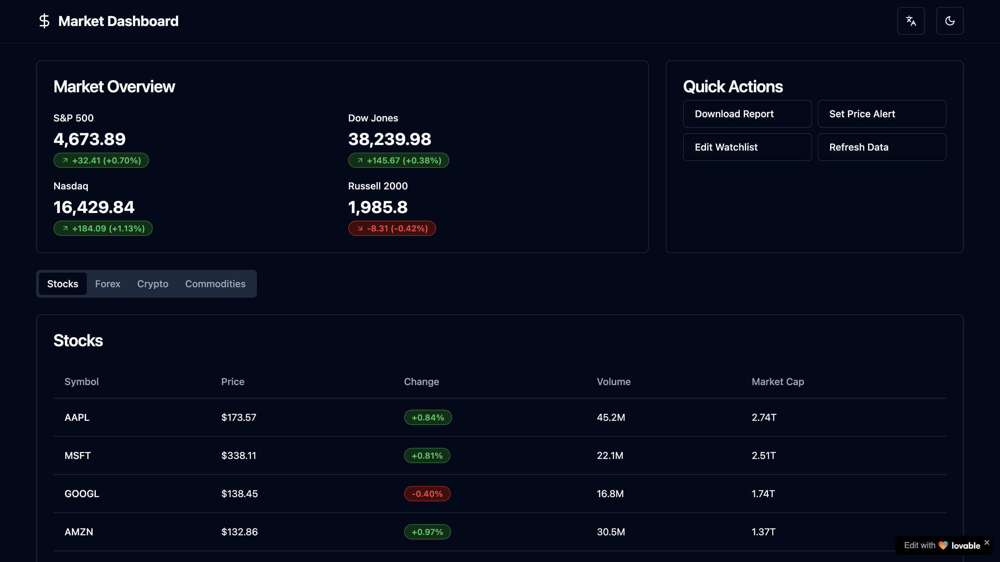

# Market Dashboard



## Overview

Market Dashboard is a modern financial dashboard application that provides real-time tracking of stocks, forex, cryptocurrencies, and commodities. Built with React and TypeScript, it offers a comprehensive view of market data with a clean, responsive interface.

## Features

- **Market Overview**: View key market indices and trends at a glance
- **Asset Tables**: Browse detailed information for various financial assets:
  - Stocks
  - Forex (Currency pairs)
  - Cryptocurrencies
  - Commodities
- **Currency Converter**: Easily convert between different currencies
- **Market News**: Stay updated with the latest financial news
- **Watchlists**: Create and manage watchlists for your favorite assets
- **Dark/Light Mode**: Switch between themes for comfortable viewing
- **Internationalization**: Available in multiple languages (English, German)

## Technologies Used

- **React** - UI library
- **TypeScript** - Type-safe JavaScript
- **Vite** - Fast build tool and development server
- **Redux Toolkit** - State management with RTK Query
- **Tailwind CSS** - Utility-first CSS framework
- **shadcn/ui** - High-quality UI components
- **Recharts** - Responsive chart components
- **i18next** - Internationalization framework
- **React Router** - Client-side routing

## Getting Started

### Prerequisites

- Node.js (v16 or later) & npm - [install with nvm](https://github.com/nvm-sh/nvm#installing-and-updating)

### Installation

```sh
# Clone the repository
git clone <YOUR_GIT_URL>

# Navigate to the project directory
cd <YOUR_PROJECT_NAME>

# Install dependencies
npm install

# Start the development server
npm run dev
```

The application will be available at `http://localhost:8080`.

## Project Structure

```
src/
├── components/     # UI components
├── data/           # Mock data for development
├── i18n/           # Internationalization files
├── lib/            # Utility functions
├── pages/          # Page components
└── store/          # Redux store configuration
```
